# Atari DIY SIO Socket

Inspired by the [SIO-M socket](https://3d.odkaznik.cz/sio-m), this one was redesigned from the Atari technical drawing and measuring the sockets on my various Atari's.  Since it shares the same physical design, I was able to extend the existing "real" SIO [socket footprint](https://github.com/pmandes/atari-sio-connector) and allow for a dual use KiCad footprint that can take either a real or this DIY version of a SIO socket.

For pins I went with the inexpensive [1.0x19.8 tin pins from RTLECS Engineering](https://www.aliexpress.us/item/2255801180069556.html) on Aliexpress.  Price has doubled since I originally designed this in the US, but they are still less than nine cents a pin in qty 100 as of late 2026.

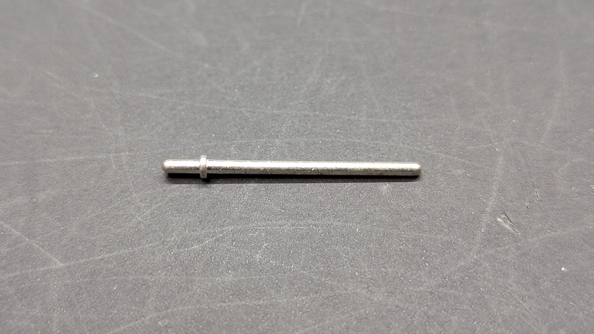

The 13 pin right angle header is a standard [2.54mm male 40 pin strip](https://www.aliexpress.us/item/2251832777289540.html) cut down to length.

# Assembly

Originally I tried assembling these by inserting the unsoldered pins in an SIO socket, but that resulted in misalignment of the pins due to pressure from the spring contacts.  Still worked, but not ideal.

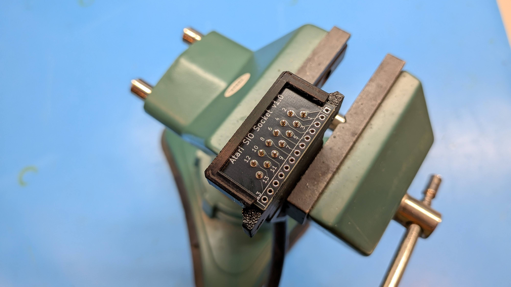

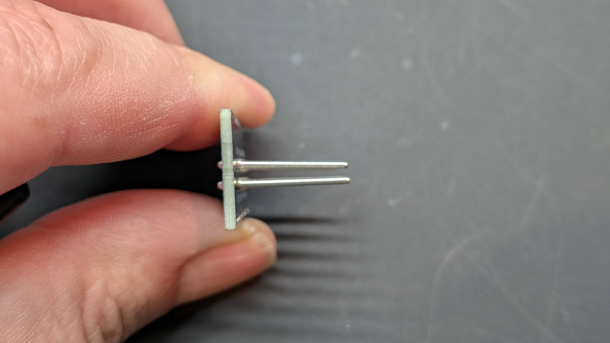

For perfectly aligned pins, you can either print the [Assembly Block](3D/STL/Atari DIY SIO Socket Assembly Block.stl).

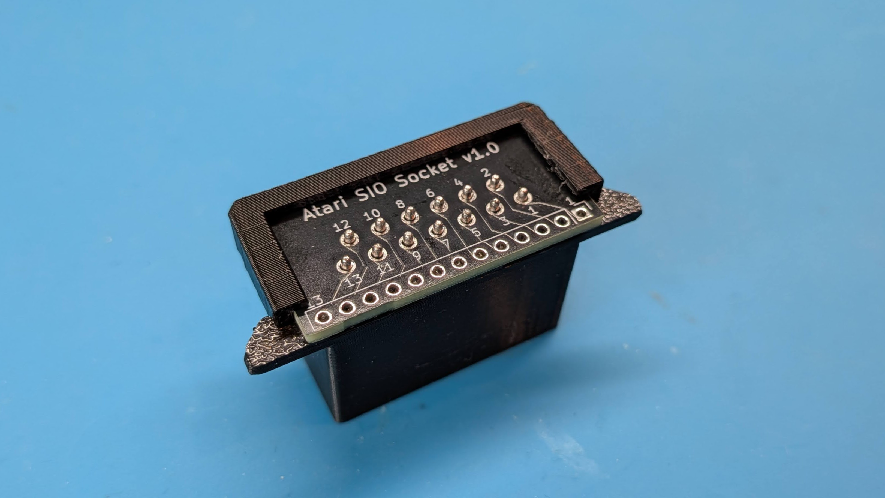

Or I also designed an [Assembly Jig](Atari-SIO-Socket-Assembly-Jig) that is two PCB's bolted together with 12mm M2.5 standoffs and M2.5x6mm taper head screws.

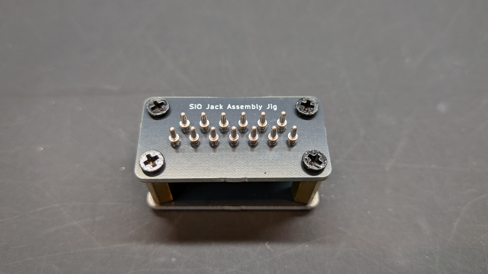

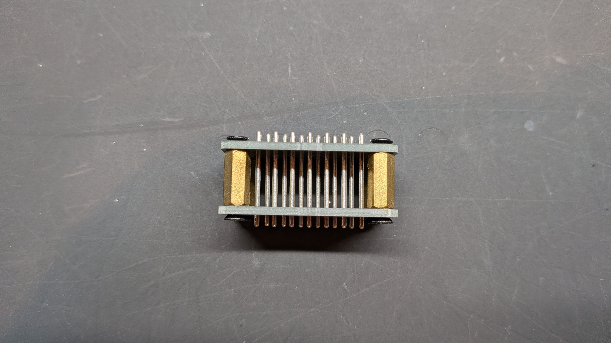

Once you have the pins soldered in, solder on the angled pin header, make sure to install the short pins on SIO socket PCB.

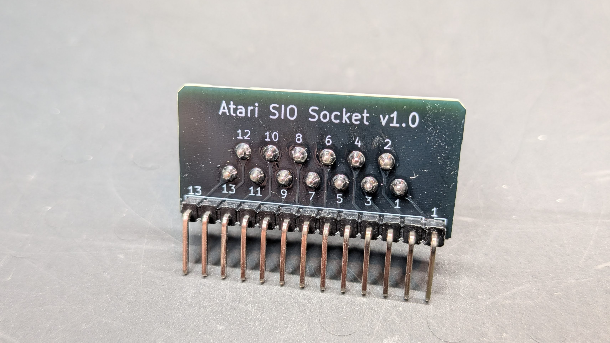

Then install in the 3D printed [socket](3D/STL/Atari DIY SIO Socket.stl) and snap on the [clip](3D/STL/Atari DIY SIO Socket Clip.stl).

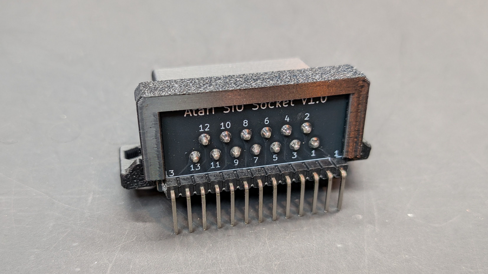

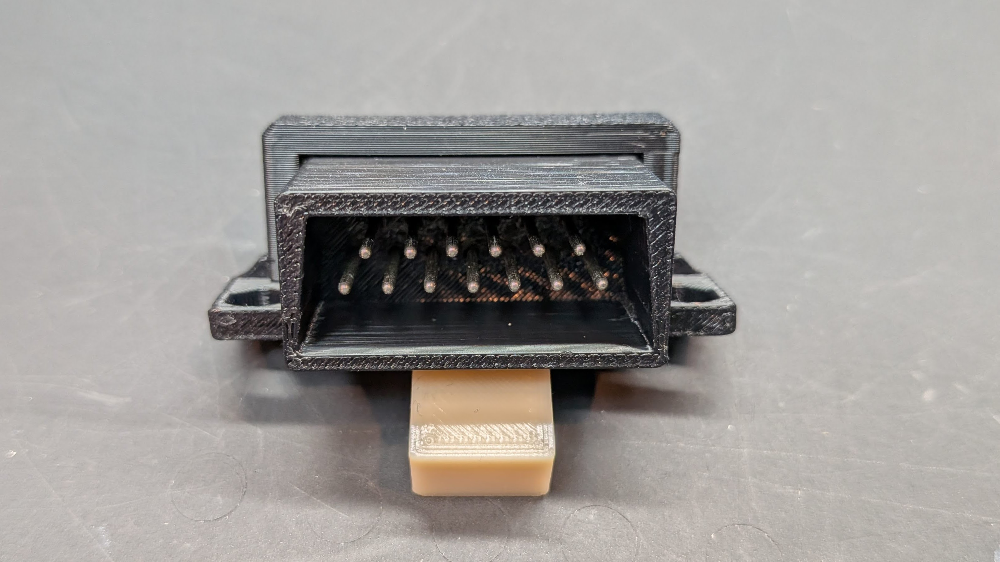

Secure to the PCB with some press fit M2.5 nuts and M2.5x6mm taper head screws before soldering to the PCB.  The PCB footprint has ovalized holes so if you don't get the angled pin header perfectly installed, your socket should still sit fine.

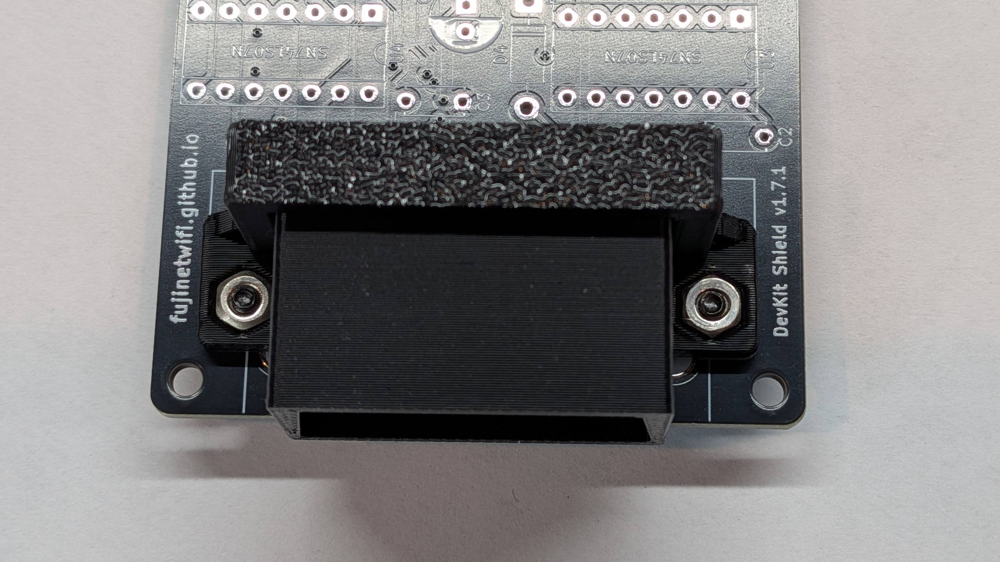

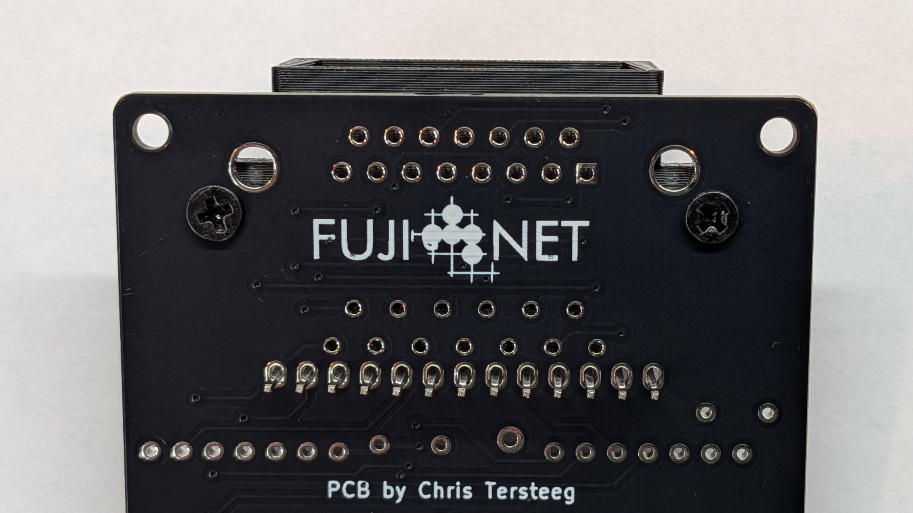

