# FujiNet DevKit Shield v1.7.1

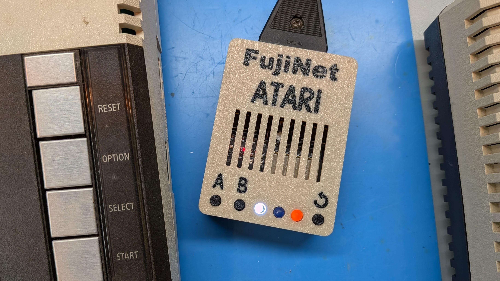

This is an alternative hardware platform for Atari 8-bit [FujiNet](https://fujinet.online/) that allows you to build your own using all through-hole technology (THT) components and an Espressif ESP32-DevKitC-VE devkit board. You must use ESP32-WROVER based devkit boards, the cheaper ESP32-WROOM boards lack the PSRAM needed by the FujiNet firmware. 

This is an update to my original v1.0 version that matches Mozzwald's latest 1.7.1 schematic (hence the big version number bump) and improves the physical design a bit. It also include an option to cable with a real SIO cable.

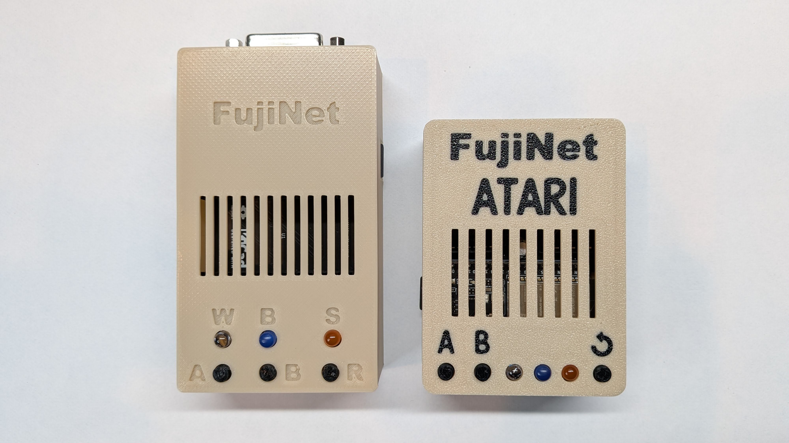

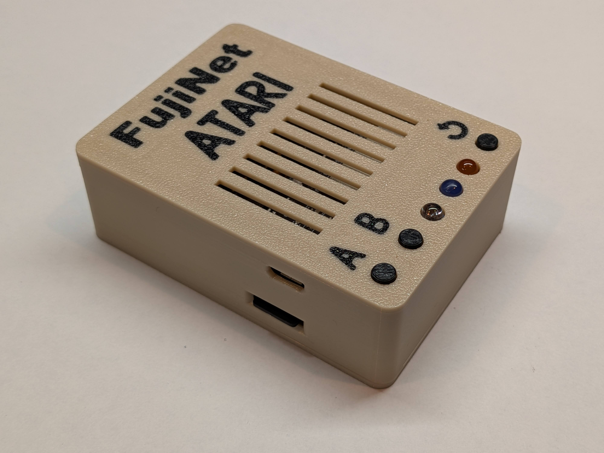

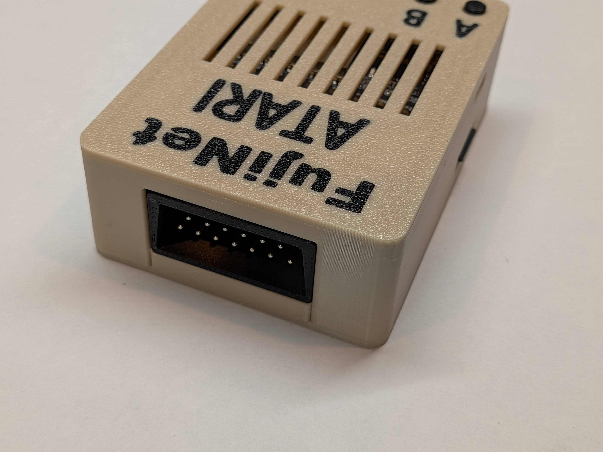

[Schematic](https://djtersteegc.github.io/fujinet-hardware/Atari/schematic-fujinet-devkit-shield-v1.7.1.pdf)

# BOM

[Interactive BOM](https://djtersteegc.github.io/fujinet-hardware/Atari/ibom-fujinet-devkit-shield-v1.7.1.html)

For cabling you have a choice between direct wire with something like a 13 pin XH2.54 header, DB-15 female socket, or using either a real or [DIY SIO socket](../Atari-DIY-SIO-Socket-v1.0/README.md).

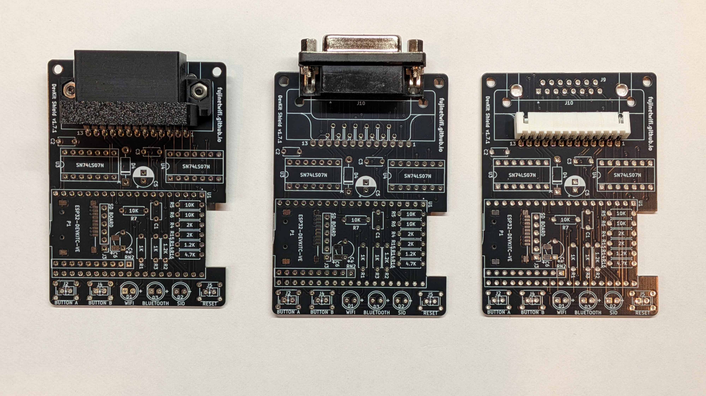

You can also use either an SMD Micro SD  connector and tantalum cap, or breakout board and THT tantalum. The current case is designed around the SMD option and it creates a much clear install, so I highly recommend that route, it's pretty easy to hand solder.

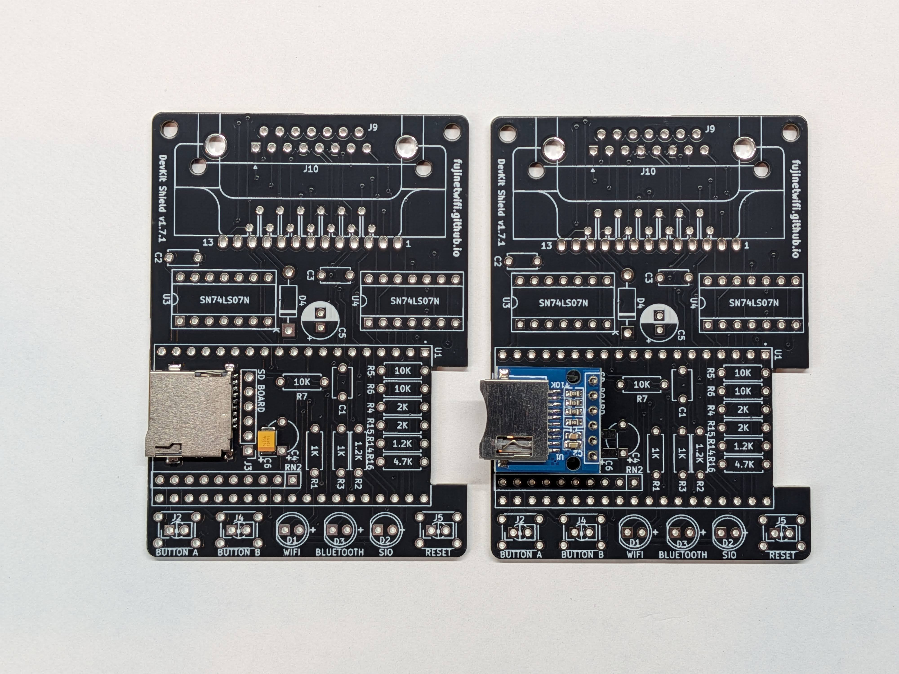

You will also need two 19p 2.54mm female header strips. I buy the the [40p versions](https://www.aliexpress.us/item/3256805857141565.html) and cut them down to size.

Make sure to buy the ESP32-DEVKITC-VE version of the devkit board. If you are in the US, [Amazon](https://www.amazon.com/gp/product/B087TNPQCV) is a great place to pick one of these up with Prime shipping.

The MicroSD sockets are readily available from [AliExpress](https://www.aliexpress.us/item/3256802643015074), [Amazon](https://www.amazon.com/Spring-Loaded-Transflash-Memory-Socket/dp/B0CDC5Q1HF), eBay and other places, sometimes called *Push Push TransFlash Socket*.

The "standard" FujiNet LED's colors are white for Wifi and orange for bus activity.

The case requires two M2.5x10mm countersunk screws. Longer scews up to 16mm will also work.

# Assembly

After installing the SMD components, proceed from shortest to tallest components.

See the [DIY SIO socket](../Atari-DIY-SIO-Socket-v1.0/README.md) repo for instructions on creating and assembling.

When it comes time to install the LED's, I place the board upside down in the case, and then use 1.2mm printed spacers to get a nice reveal of the LED domes just poking through the case top.

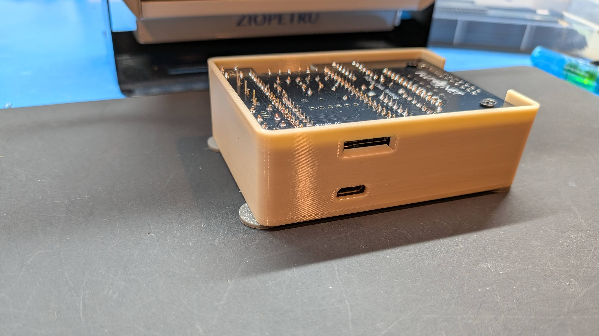

Here's all assembled without the ESP32 mounted on the female headers.

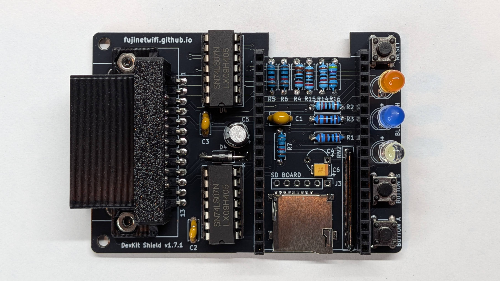

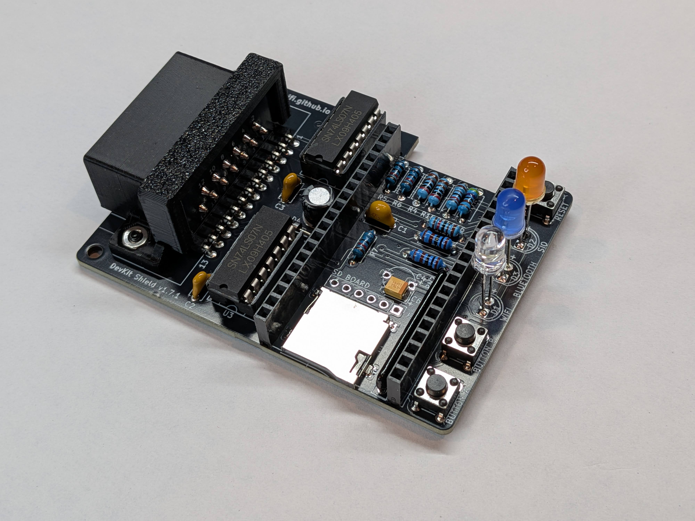

# Case

Pick the option to corresponds to your cabling choice.  If you have multiple color capability on your printer, you can use the [fujinet-devkit-shield-v1.7.1-embossed-text.stl](3D/STL/fujinet-devkit-shield-v1.7.1-embossed-text.stl) file to inlay colored text.  Make sure to print three copies of the buttons.  Assemble with M2.5x10mm countersunk screws.

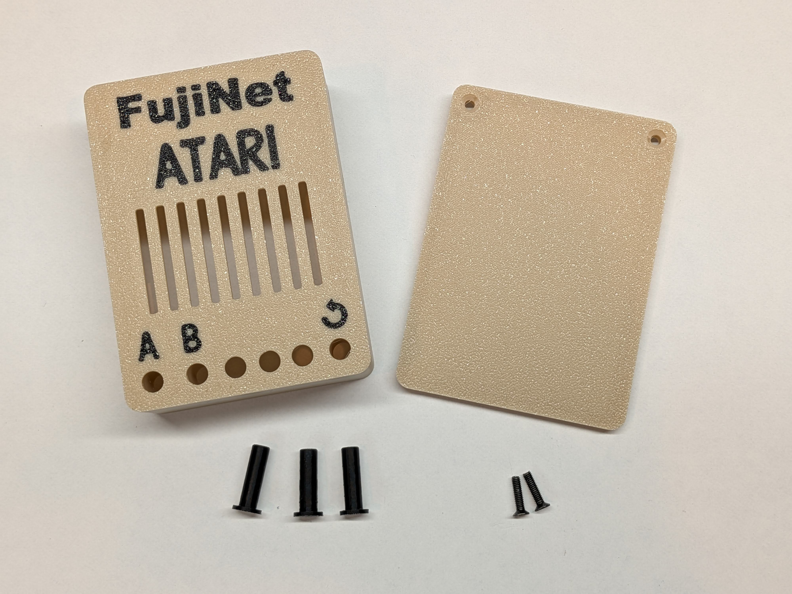

# Flashing

Since the DevKit version has less flash than the SMD version, in FujiNet Flasher, you need to manually download the fujinet-ATARI-8mb-* (e.g. [fujinet-ATARI-8mb-v1.6.1.zip](https://github.com/FujiNetWIFI/fujinet-firmware/releases/download/v1.6.1/fujinet-ATARI-8mb-v1.6.1.zip)) firmware from the https://github.com/FujiNetWIFI/fujinet-firmware/releases page and then use the FujiNet Flasher to flash a Custom Firmware File.

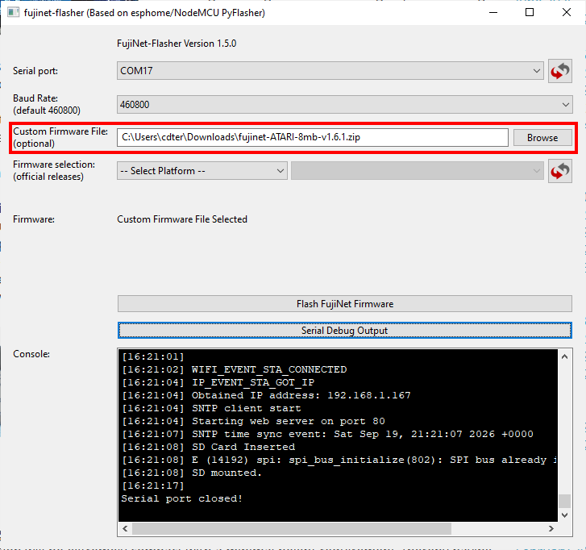

