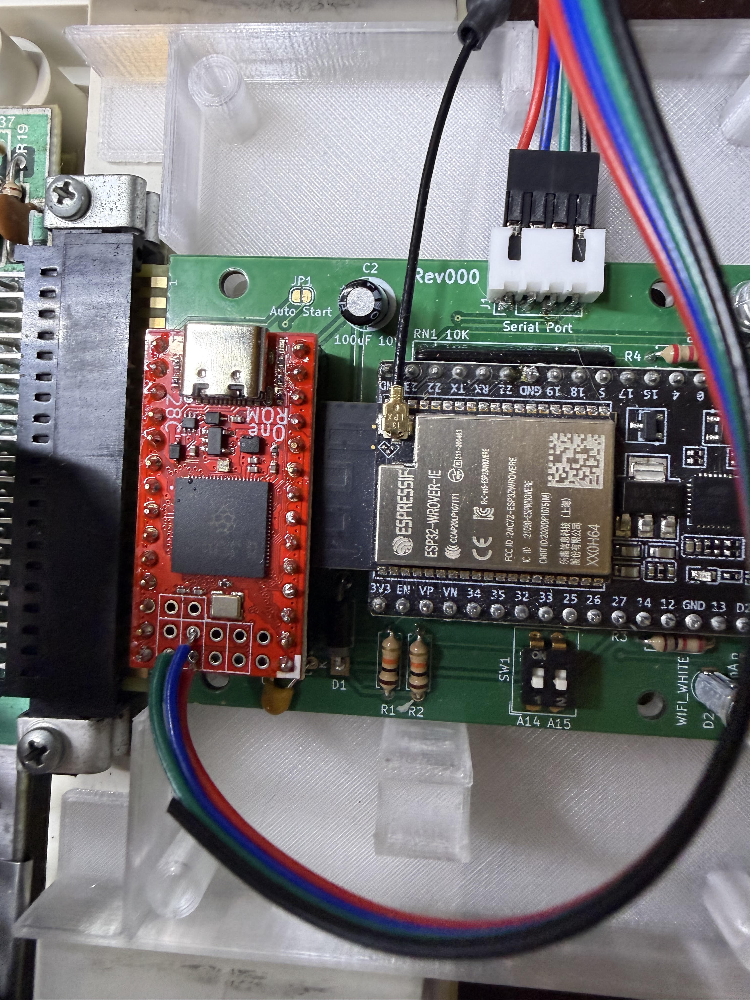

# One ROM Fire 28C

This is a different approach to the other CoCo builds in this repo. Rather
than a purpose-built CoCo-FujiNet cartridge PCB with its own EPROM and its
own mounted ESP32, this build uses two off-the-shelf boards:

- An [One ROM Fire 28C](https://onerom.org/) - a drop-in RP2350-based
  replacement for the 28-pin HDB-DOS ROM chip, socketed directly where the
  HDB-DOS EPROM/mask ROM would normally go.
- An existing ESP32 DevKitC (or clone), flashed with the ESP32 firmware
  included here, wired to the One ROM over a 3-wire UART cable.

The One ROM runs a `drivewire` bridge plugin that relays DriveWire traffic
between the CoCo (over the ROM's own address/data bus, using a `!LDCART!`
knock protocol) and the ESP32 (over a real UART), so the ESP32 doesn't need
its own serial or parallel port wiring into the CoCo at all - the One ROM
chip does that job in software.

## Hardware you need

- A One ROM Fire 28C (28-pin form factor, RP2354B/QFN-80).
- An existing ESP32 DevKitC (or clone), flashed with the ESP32 firmware
  included here (see [binaries](binaries)).
- A 2- or 3-wire cable between the One ROM's `J2` header and the FujiNet
  board's `J1` (serial) header - see below.

## Programming the One ROM

The One ROM needs three things composed into one firmware image and flashed
to it: the base One ROM firmware, the HDB-DOS ROM image (a One ROM-specific
build that speaks the bridge's protocol instead of driving a serial port
directly), and the `drivewire` bridge plugin. Prebuilt copies of all of these
are in [binaries](binaries):

- `onerom-rp235x.bin` - base One ROM firmware.
- `hdbonerom.rom` - the ONEROM HDB-DOS build (`!LDCART!`/DriveWire-over-bus
  variant).
- `drivewire_plugin.bin` - the DriveWire bridge plugin.
- `config.dsk` - the FujiNet config app disk image, used to boot into
  Config the first time so you can set up WiFi etc.
- `fujinet-COCO-HS-UART-v1.6.2-dev.zip` - the ESP32-side FujiNet firmware to
  flash onto the separate ESP32 board.

Using the [One ROM CLI](https://onerom.org/cli):

```bash
onerom program \
  --base-firmware binaries/onerom-rp235x.bin \
  --slot file=binaries/hdbonerom.rom,type=27128,size-handling=duplicate \
  --plugin usb \
  --plugin file=binaries/drivewire_plugin.bin
```

`type=27128,size-handling=duplicate` matters: the Fire 28C ties address
lines A14/A15 to the board's own DIP switches rather than driving them
itself, so declaring a 16K chip type and mirroring the 8K HDB-DOS image
across both halves (`size-handling=duplicate`) makes the ROM boot correctly
regardless of the DIP switch position.

Once flashed, socket the One ROM in the CoCo's HDB-DOS ROM position as
normal, and boot to `config.dsk` (via floppy/HDB-DOS as you normally would)
to get the FujiNet Config app running the first time so you can configure
WiFi.

## Building the cable

The bridge uses One ROM's RP2350 UART1, which on the Fire 28C shares pins
with the `SEL_C`/`SEL_D` image-select pads (`J2` on the board). Leave the
`SEL_C`/`SEL_D` jumper **unpopulated** - if it's soldered in, it will
electrically contend with the UART signal.

`J2` is an 8-pin (2x4) header; only three of its pins are needed:

| One ROM `J2` pin | Signal   |
| ---------------- | -------- |
| 1                 | `SEL_C`  |
| 2                 | `GND`    |
| 3                 | `SEL_D`  |

Wire these straight through, pin-for-pin, to the FujiNet board's `J1`
(serial) header:

| One ROM `J2` | FujiNet `J1` |
| ------------ | ------------ |
| 1            | 1            |
| 2 (optional) | 2            |
| 3            | 3            |

The ground connection (pin 2) is optional if both boards already share a
common ground (e.g. via USB power from the same computer) - but it's cheap
insurance to include it if you're running separate power supplies.

These are 3.3V UART signals - GPIO40/41 on the One ROM are ADC-capable,
3.3V-only pins, not 5V-tolerant, so don't wire this to anything that could
drive 5V TTL levels onto them.



## Usage

Power on the CoCo. The One ROM boots straight into HDB-DOS as normal; the
DriveWire bridge plugin runs transparently in the background on the One
ROM's spare core, relaying traffic to and from the ESP32 over the cable
above. From the CoCo's point of view this looks exactly like a normal
DriveWire-over-serial HDB-DOS setup.
